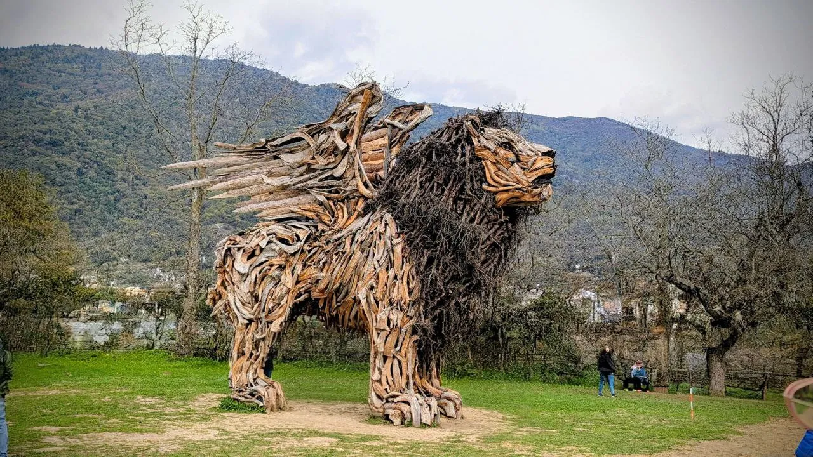
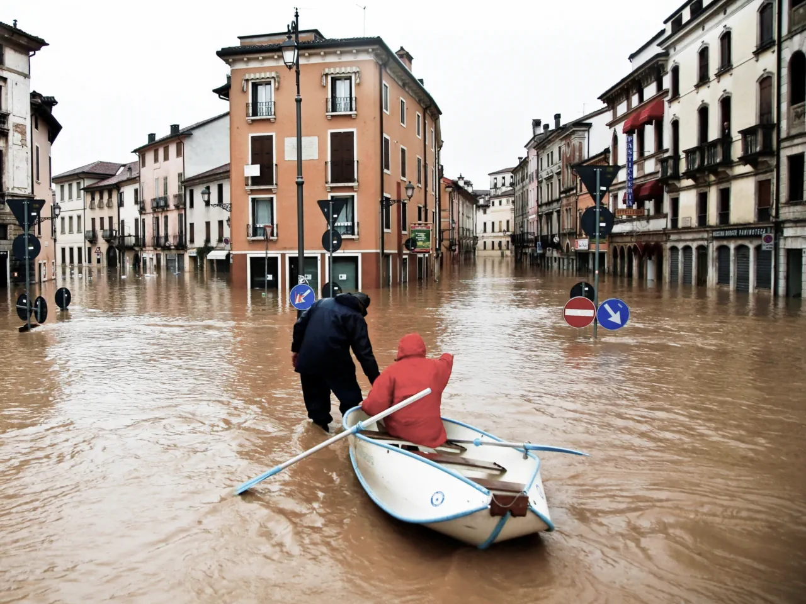

## Personal

In the last weeks there were some ups and downs, I had to deal with some
anxiety, but it has been much better than [week
39](file:///posts/week_39/). The change of season and the switch from
DST to Standard Time always takes a toll on my mental health.

That said, I'm not a hermit. I'm still enjoying going out with my
girlfriend and friends. My agoraphobia kicks in only when I'm alone.

In the past weeks, in random order:

### Conegliano & The Winged Lion

We visited some friends in
[Conegliano](https://en.wikipedia.org/wiki/Conegliano) (one of the
birthplaces of [Prosecco](https://en.wikipedia.org/wiki/Prosecco) wine),
we visited the "Winged Lion" made by Marco Martalar. Martalar's
sculptures are made with the wood of the fallen trees caused by the
[Storm Vaia](https://en.wikipedia.org/wiki/Storm_Adrian#Art) in
[2018](https://www.guidedolomiti.com/en/miscellaneous/storm-vaia/).
There are a few of these sculptures. You can see them
[here](https://www.artsharing.org/artisti/marco-martalar).

<figure width="auto"
alt="Wood sculpture of a winged lion in the countryside" loading="lazy">

<figcaption>Martalar's Lion</figcaption>
</figure>

After a short hike, we had lunch together at
[Andreetta](https://www.andreetta.it/) restaurant: fine wines and
delicious food.

Probably the next sculpture we are going to visit will be the "Winged
Dragon" in [Lavarone](https://en.wikipedia.org/wiki/Lavarone).

### Halloween

The last time I did something fun on Halloween night was in 2010. That
night, one of the main rivers in Vicenza (my hometown), flooded our
district, [Borgo San
Pietro](https://en.wikipedia.org/wiki/Borgo_San_Pietro_(Vicenza)). We
went to a treasure hunt that night, dressed up as monsters. The next day
we woke up with 30cm of brown water inside the house. By the end of that
morning the water rose to about 1m, so we fled and got hospitality from
family members and friends. We moved back in our home a year after.

<figure width="auto" alt="A picture of the 2010 flood in Vicenza"
loading="lazy">

<figcaption>2010 flood</figcaption>
</figure>

So no, I don't really like Halloween, and for years after I couldn't
enjoy the sound of the rain.

This year we celebrated Halloween after 15 years, I dressed as a vampire
(quite easy), and my gf as a voodoo queen. We met with some friends at a
local club and "enjoyed" a cover band of Nightwish and Epica (not really
my music genre). I was tense at the beginning, but after a couple of
[Americano](https://en.wikipedia.org/wiki/Americano_(cocktail)) I
started to enjoy the evening.

<figure width="auto"
alt="A collage of photos of me, a friend and my girlfriend dressed for Halloween"
loading="lazy">

<figcaption>Me and my friend Carmine on the left, my gf on the
right</figcaption>
</figure>

## Code

### LLM

I discovered [OpenRouter](https://openrouter.ai/) and cancelled my
OpenAI plan. OpenRouter allows to get access to multiple LLM models
thanks to a unified API and it also automatically routes your prompts to
the "best" model based on cost, latency and availability. (I'm not
related with OpenRouter in any way, I just think it's a wonderful
service).

Thanks to OpenRouter I managed to:

- Deploy an instance of
  [OpenWebUI](https://github.com/open-webui/open-webui), to have a
  "personal" Chat and RAG experience, choosing between 500+ models.
- Implement a couple of useful [n8n](https://github.com/n8n-io/n8n)
  workflows, such as transforming documents, photos, or vocal memos
  directly to org-mode, ready to be copied and pasted through a Telegram
  bot.
- Start to use Claude Code cli tool. Thanks to [Claude Code
  Router](https://github.com/musistudio/claude-code-router) (ccr), I can
  use OpenRouter models instead of Anthropic models (they're not cheap).
  At the moment I'm really enjoying [GLM
  4.6](https://huggingface.co/zai-org/GLM-4.6) from [Z.ai](https://z.ai)
  for coding and Gemini 2.5 Flash for quick tasks.
- I also added
  [claude-code.el](https://github.com/stevemolitor/claude-code.el) by
  Steve Molitor to my [Emacs
  configuration](https://github.com/mdallastella/.emacs.d). It's nice to
  have an AI assistant inside the editor. I don't do any vibe-coding
  sessions, but it's helpful for tedious tasks. I tried ECA and Aider
  before, but I wasn't completely satisfied with the integrations and
  the configuration. I will keep a look at ECA, anyway, in case Claude
  Code will stop working with ccr.

### Go

After [giving up](/posts/week_37/) with Rust, I took a look at
Zig, but I don't think the ecosystem is mature yet for production and,
like Rust, it's too low level for my needs.

Instead, I started to study Go. I'm still not a fan of imperative
programming, but I find Go better than Python TBH. First of all, Go can
be compiled to a single portable binary: this is useful with docker
images, where with Python I need to produce huge images with all the
project dependencies. Go does not need external libraries or funny
tricks for async or concurrency, and does not have Python GIL
limitations. Also, thanks to Clojure core.async, I'm already familiar
with the CSP model.

## Notable links

- [Anthropic: A small number of samples can poison LLMs of any
  size](https://www.anthropic.com/research/small-samples-poison)
- [E.W.Dijkstra Archive: Home page](https://www.cs.utexas.edu/~EWD/)
- [Big Tech Is Faking Revenue -
  YouTube](https://www.youtube.com/watch?v=CBCujAQtdfQ)
